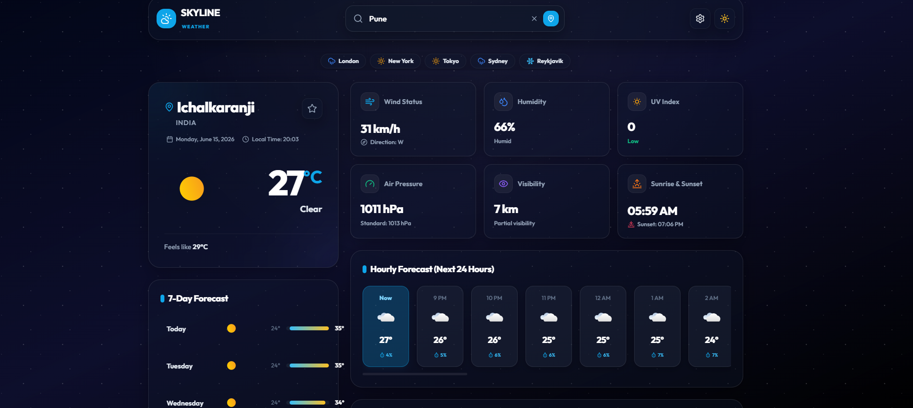
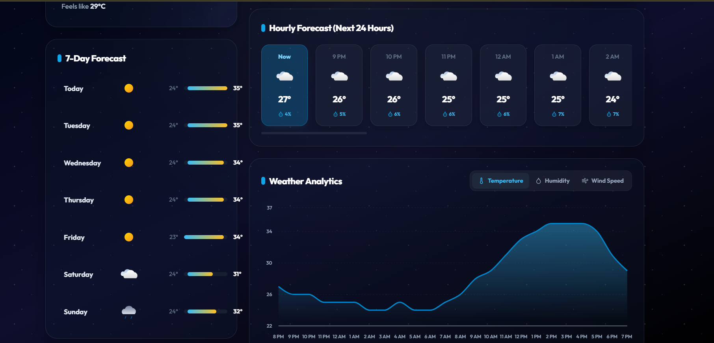

 # 🌤️ Skyline Weather

<p align="center">
  <strong>A premium SaaS-style Weather Forecast & Data Analytics Dashboard.</strong>
</p>

<p align="center">
  <a href="https://skyline-weather-sand.vercel.app/" target="_blank">
    
  </a>
  <a href="https://github.com/suraj-5021/skyline-weather" target="_blank">
    
  </a>
</p>

<p align="center">
  
  
  
  
  
</p>

---

## 📌 Project Overview

**Skyline Weather** is a modern weather analytics platform built with React, Tailwind CSS, and real-time weather APIs. The application provides current conditions, hourly forecasts, 7-day predictions, weather analytics, and environmental insights through an intuitive dashboard interface designed for both desktop and mobile users. 

Built with premium SaaS aesthetics in mind, it features custom ambient gradients, particle weather systems (rain, snow, drifting clouds, lightning storms) that respond in real-time to weather states, and interactive charts that present key historical indices.

---

## ⚡ Features

- 🌤️ **Real-Time Weather Data**: Direct integrations mapping temperatures, weather conditions, local time, and coordinates.
- 🔍 **Smart City Search**: Debounced search bar with automatic suggestions, tabbed history logs, and location autocomplete.
- 🕒 **Hourly Forecast**: 24-hour horizontal scrolling view of temperatures and precipitation probability.
- 📅 **7-Day Forecast**: Weekly forecast display featuring Apple Weather-style temperature span visualizers.
- 📊 **Weather Analytics Dashboard**: Interactive graphs plotting temperature trends, relative humidity curves, and wind speed bars.
- ☀️ **UV Index Monitoring**: Clear solar radiation indexes matched with safety alerts and descriptions.
- 💧 **Humidity Tracking**: Tracks water vapor percentages with comfort descriptions.
- 💨 **Wind Speed Monitoring**: Measures wind velocity vectors and directional coordinates.
- 🧭 **Pressure & Visibility Metrics**: Telemetry detailing visibility ranges in kilometers and barometric force (hPa).
- 📱 **Responsive Design**: Mobile-first fluid grid layout optimized below `768px` and `480px`.
- ⚙️ **API Configuration**: Integrated settings modal saving custom WeatherAPI keys in browser `localStorage`.
- 🛡️ **API Fallback System**: Deterministic, pseudo-random generator seeded on searched city names. Works instantly in offline or demo modes without an API key.

---

## 📸 Screenshots

### 🖥️ Dashboard View
 


### Forecast and Analytics



## 🛠️ Technology Stack

- **React.js**: Frontend state and interactive DOM container.
- **Vite**: Rapid asset compilation and bundle scaffolding.
- **Tailwind CSS**: Glassmorphic layout utilities and responsive style definitions.
- **Framer Motion**: Ambient fade transitions, rotate switches, and spring overlays.
- **Recharts**: Telemetry graphs (Area, Line, Bar charts).
- **WeatherAPI**: Real-time meteorological indices.
- **Vercel**: Global edge hosting and deployment pipeline.

---

## 📐 Project Architecture

```
                 +-----------------------------------------+
                 |               User Search               |
                 +--------------------+--------------------+
                                      |
                                      v
                 +--------------------+--------------------+
                 |             API Request                 |
                 +--------------------+--------------------+
                                      |
                 +--------------------+--------------------+
                 |           WeatherAPI.com Client         |
                 +--------------------+--------------------+
                                      |
              (Success)               |              (Fallback / Offline)
        +-----------------------------+-----------------------------+
        |                                                           |
        v                                                           v
+-------+---------------+                                   +-------+---------------+
| Parse Live JSON Data  |                                   | Generate Seeding Data |
+-------+---------------+                                   +-------+---------------+
        |                                                           |
        +-----------------------------+-----------------------------+
                                      |
                                      v
                 +--------------------+--------------------+
                 |           React State Manager           |
                 +--------------------+--------------------+
                                      |
                                      v
                 +--------------------+--------------------+
                 |          Glassmorphism UI               |
                 +-----------------------------------------+
```

---

## ⚙️ Installation

1. **Clone the Repository**
   ```bash
   git clone https://github.com/suraj-5021/skyline-weather.git
   cd skyline-weather
   ```

2. **Install Dependencies**
   ```bash
   npm install
   ```

3. **Start Local Development Server**
   ```bash
   npm run dev
   ```

4. **Verify Production Compilation**
   ```bash
   npm run build
   ```

---

## 🔑 Environment Variables

Create a `.env` file in the root directory and add your key:

```env
# WeatherAPI Key (Optional: Leave blank for demo mode)
VITE_WEATHER_API_KEY=your_api_key_here
```

*Note: If `VITE_WEATHER_API_KEY` is not present, the dashboard runs in **Demo Mode**, generating realistic weather stats deterministically based on your search city name.*

---

## 🎓 Key Learning Outcomes

- **API Adapter Integrations**: Built robust mapping adapters linking raw API payloads to strict local frontend schemas.
- **State Flow & Sync**: Handled bi-directional state synchronization (e.g. tracking search focus to trigger transitions in dashboard backdrops).
- **Responsive Telemetry Design**: Refined padding ratios and flex boundaries ensuring mobile views (<480px) display text-heavy cards cleanly.
- **Dynamic Render Passes**: Connected visual variables (CSS gradients and SVG animations) to condition IDs, transforming background themes on-the-fly.
- **Framer Motion Orchestration**: Integrated staggered motion lists, scale bounces, and slide overlays.
- **Vercel Deployments**: Deployed production bundles with continuous Git pipelines.

---

## 🚀 Future Improvements

- [ ] **Air Quality Index**: Map AQI metrics, carbon counts, and PM2.5 readings.
- [ ] **Alerts & Warnings**: Real-time push notifications for extreme local weather alerts.
- [ ] **Multi-Language Support**: Localized translations for global dashboard layouts.
- [ ] **PWA Support**: Offline caching and local browser install options.
- [ ] **User Accounts**: Cloud authentication to sync favorite locations.

---

## 👤 Author

**Suraj Soni**
- GitHub: [@suraj-5021](https://github.com/suraj-5021)
- LinkedIn: [Suraj Soni](https://www.linkedin.com/in/suraj-soni-1773a5320)

---

<p align="center">
  Built with ❤️ using React and modern web technologies.
</p>
